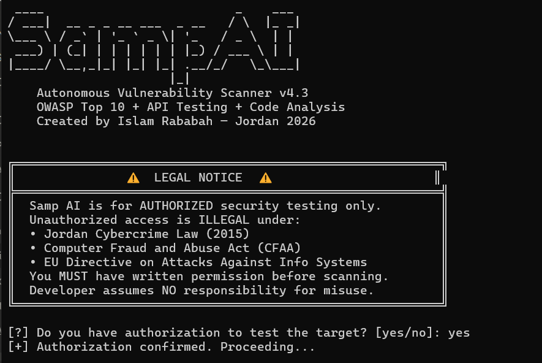
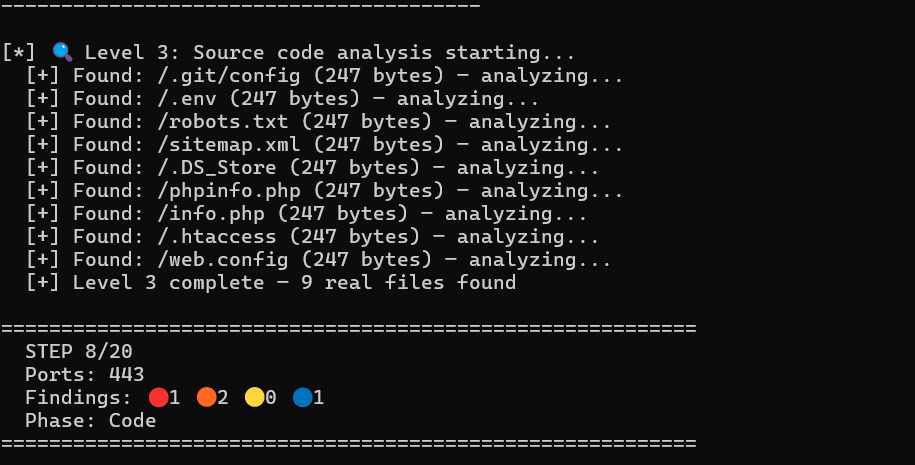
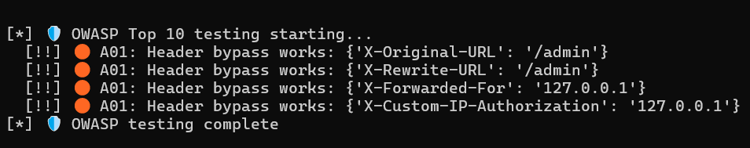
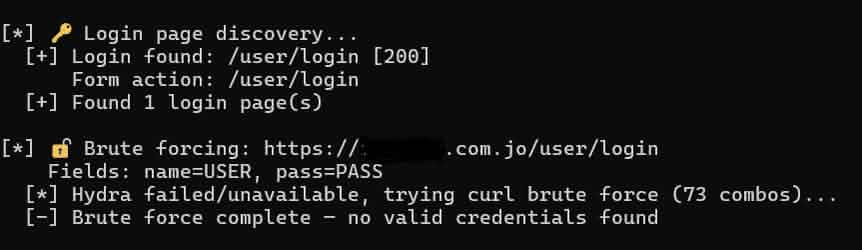
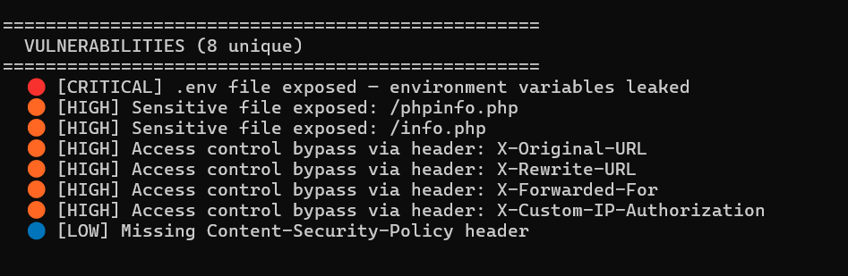

# Samp AI — Autonomous Vulnerability Scanner
### v4.4 | Powered by Llama 3 8B (Local, Offline)


**Created by Islam Rababah — Jordan 2026**

---

## What is Samp AI?

Samp AI is an autonomous penetration testing agent powered by a local AI model (Llama 3 8B via Ollama). It runs completely offline — no internet required, no external APIs, no data sent anywhere.

The agent thinks, decides, executes, and reports automatically across 20 steps covering recon, discovery, code analysis, OWASP testing, API testing, and brute force.

**For authorized security testing only. Unauthorized use is illegal.**

---

## Features

### Phase 1 — Recon
- Nmap port scanning with service and version detection
- HTTP headers analysis
- CDN and WAF detection (Cloudflare, F5 BigIP, Akamai, Imperva)
- Soft 404 baseline calibration to eliminate false positives

### Phase 2 — Discovery
- Gobuster directory enumeration
- FFUF fuzzing with smart status code filtering
- Nuclei CVE scanning (2272+ templates)
- Anti-repetition system with tool usage counter

### Phase 3 — AI Source Code Analysis
- Extracts real JavaScript files directly from HTML source
- Sends code to Llama 3 8B for security review
- Regex scanning for hardcoded secrets (API keys, passwords, JWT secrets, AWS keys)
- Detects XSS patterns (innerHTML, eval, document.write)
- Discovers hidden admin endpoints and internal API URLs

### Phase 4 — OWASP Top 10 (Automated)

| Category | Tests Performed |
|---|---|
| A01 Broken Access Control | Header bypass (X-Original-URL, X-Rewrite-URL), path traversal, admin panel access |
| A02 Cryptographic Failures | HTTP without HTTPS redirect, sensitive data in source |
| A03 Injection | Reflected XSS, error-based SQLi, command injection |
| A05 Security Misconfiguration | CORS wildcard, clickjacking, debug info in errors |
| A07 Auth Failures | Default credentials, login page detection |
| A09 Logging Failures | Stack trace and exception exposure in API responses |

### Phase 5 — API Discovery and Testing
- Auto-discovers /api/v1, /api/v2, /graphql, /swagger, /openapi
- Parses Swagger and OpenAPI specs for endpoint enumeration
- IDOR testing via object ID increment
- Authentication bypass testing
- HTTP method tampering (DELETE, PUT, PATCH)
- Mass assignment via JSON parameter injection
- Rate limiting check (10 rapid requests)

### Phase 6 — Login Detection and Brute Force
- Automatically finds login pages and parses form fields
- Tries Hydra first, falls back to curl-based brute force
- Default passwords combined with Rockyou top 500
- Baseline response comparison to avoid false positives
- Supports HTTP form and JSON login endpoints

### Reporting
- Professional Markdown reports generated without Ollama (no timeout)
- CVSS 3.1 scores per finding
- OWASP category mapping table
- Security headers analysis
- Prioritized remediation steps ordered by severity

### Memory System
- SQLite database stores every executed command
- Prevents duplicate commands across steps
- Resume previous scans without starting over
- Tool usage limits enforced per session

---

## Tech Stack

| Component | Technology |
|---|---|
| AI Engine | Llama 3 8B via Ollama |
| Language | Python 3.10+ |
| Memory | SQLite |
| Port Scanner | Nmap 7.94 |
| Vulnerability Scanner | Nuclei v3.3 |
| Directory Fuzzer | FFUF + Gobuster |
| Brute Force | Hydra + Curl |
| Web Fingerprint | Whatweb |
| Platform | WSL Ubuntu on Windows 11 |
| GPU | NVIDIA RTX 2050 |

---

## Screenshots











---

## Requirements
```bash
# Python
pip install requests urllib3

# Tools on WSL Ubuntu
sudo apt install nmap gobuster nikto dirb whatweb hydra
pip install nuclei
```

---

## Usage
```bash
# Clear previous session
rm -f pentest_memory.db

# Run
python3 chat_v4.py
```

Commands during scan:
- y — run command
- n — skip
- e — edit command manually
- a — auto mode (runs all remaining steps)
- q — quit

---

## Changelog

| Version | Changes |
|---|---|
| v1.0 | Basic scanning with custom Transformer model |
| v2.0 | Migrated to Llama 3 via Ollama |
| v3.0 | Added Cloudflare bypass strategy, anti-repetition logic |
| v4.0 | Source code analysis, API discovery and testing |
| v4.1 | Fixed soft 404 detection, tool availability check |
| v4.2 | AI-powered JS file analysis, real file validation |
| v4.3 | Full OWASP Top 10 automation, API IDOR testing |
| v4.4 | Login detection, brute force engine, JS extraction from HTML |

---

## Legal Disclaimer

Samp AI is built for authorized security testing only.

Unauthorized access to computer systems is illegal under:
- Jordan Cybercrime Law (2015)
- Computer Fraud and Abuse Act (CFAA)
- EU Directive on Attacks Against Information Systems

The developer assumes no responsibility for misuse of this tool.

---

## Contact

**Islam Rababah**
- LinkedIn: https://www.linkedin.com/in/islam-rababah
- Email: islamrababa@gmail.com

---

Built in Jordan — 2026
